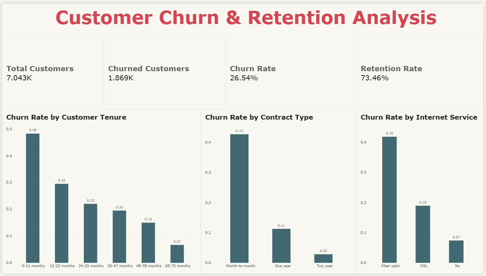
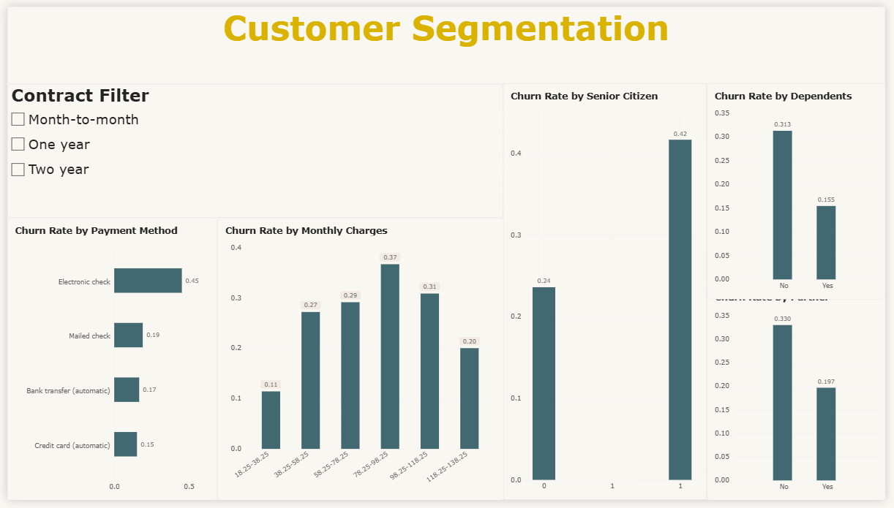
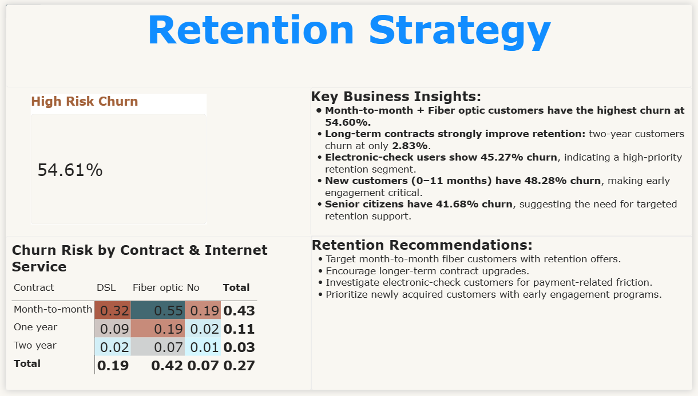

# 📊 Customer Churn Analysis

An end-to-end **Business Analytics project** focused on understanding customer churn, identifying high-risk customer segments, and translating customer data into actionable retention strategies using **MySQL and Power BI**.

The project combines SQL-based analysis, customer segmentation, KPI development, and an interactive Power BI dashboard to answer a key business question:

> **Which customers are most likely to churn, and where should retention efforts be prioritized?**

---

## 🎯 Business Problem

Customer churn can reduce the active customer base and weaken long-term customer relationships.

This project analyzes customer-level data to identify the characteristics and segments associated with higher churn and convert those findings into practical retention recommendations.

### Key Business Questions

* What is the overall customer churn rate?
* Which contract types have the highest churn?
* How does customer tenure relate to churn?
* Which payment methods are associated with higher churn?
* How does internet service type relate to churn?
* How do monthly charges vary across churn segments?
* Which customer segments show the highest observed churn?
* What retention actions can be prioritized based on the findings?

---

## 🎯 Project Objectives

* Measure overall **customer churn and retention**
* Identify major **churn patterns and high-risk segments**
* Analyze churn across contract, tenure, payment, internet service, and customer characteristics
* Create meaningful customer segments for business analysis
* Build an interactive **Power BI dashboard**
* Translate analytical findings into **data-driven retention recommendations**

---

## 🗂️ Dataset

The project uses the **Telco Customer Churn dataset** containing:

* **7,043 customers**
* **21 attributes**
* Customer demographics
* Contract information
* Internet service details
* Payment methods
* Tenure
* Monthly charges
* Total charges
* Churn status

### Data Preparation

The dataset was cleaned and prepared before analysis, including handling blank values in the `TotalCharges` field.

The final dataset contains:

* **7,043 unique customer records**
* **21 attributes**
* **No missing values**

---

## 🛠️ Tools & Technologies

| Tool            | Purpose                                           |
| --------------- | ------------------------------------------------- |
| **MySQL**       | SQL-based data analysis and customer segmentation |
| **Power BI**    | Interactive dashboard and data visualization      |
| **DAX**         | KPI measures and calculated groups                |
| **Excel / CSV** | Data cleaning and preprocessing                   |
| **GitHub**      | Project documentation and version control         |

---

# 🔄 Analytical Workflow

```text
Raw Customer Data
        ↓
Data Cleaning & Preparation
        ↓
MySQL Analysis
        ↓
Customer Segmentation
        ↓
KPI Calculation
        ↓
Power BI Dashboard
        ↓
Business Insights
        ↓
Retention Recommendations
```

---

# 📈 Key Business Results

## Overall Customer Performance

| KPI               |     Result |
| ----------------- | ---------: |
| Total Customers   |  **7,043** |
| Churned Customers |  **1,869** |
| Churn Rate        | **26.54%** |
| Retention Rate    | **73.46%** |

---

## 🔍 Key Churn Insights

### 1. Contract Type

| Contract Type  | Churn Rate |
| -------------- | ---------: |
| Month-to-month | **42.71%** |
| One year       | **11.27%** |
| Two year       |  **2.83%** |

Month-to-month customers show substantially higher churn than customers on longer-term contracts.

**Business implication:** Retention efforts can prioritize month-to-month customers and encourage suitable upgrades to longer-term contracts.

---

### 2. Customer Tenure

| Tenure Group | Churn Rate |
| ------------ | ---------: |
| 0–11 months  | **48.28%** |
| 12–23 months | **29.51%** |
| 24–35 months | **22.03%** |
| 36–47 months | **19.52%** |
| 48–59 months | **15.00%** |
| 60–72 months |  **6.68%** |

The **0–11 month** customer group has the highest observed churn rate.

**Business implication:** Early-tenure customers should receive stronger onboarding, engagement, and retention attention.

---

### 3. Payment Method

| Payment Method   | Churn Rate |
| ---------------- | ---------: |
| Electronic check | **45.27%** |
| Mailed check     | **19.11%** |
| Bank transfer    | **16.71%** |
| Credit card      | **15.24%** |

Electronic-check customers show the highest observed churn rate among payment methods.

**Business implication:** The payment experience of this segment can be investigated for potential friction and retention opportunities.

---

### 4. Internet Service

| Internet Service    | Churn Rate |
| ------------------- | ---------: |
| Fiber optic         | **41.89%** |
| DSL                 | **18.96%** |
| No internet service |  **7.40%** |

Fiber optic customers show a substantially higher observed churn rate than the other internet-service groups.

---

### 5. Monthly Charges

| Monthly Charge Group |  Churn Rate |
| -------------------- | ----------: |
| $18.25–$38.25        |  **11.41%** |
| $38.25–$58.25        |  **27.18%** |
| $58.25–$78.25        |  **29.12%** |
| $78.25–$98.25        |  **36.66%** |
| $98.25–$118.25       |  **30.84%** |
| $118.25–$138.25      | **20.00%*** |

*The final group contains only **5 customers**, so the rate should not be interpreted as a representative segment-level pattern.

The $78.25–$98.25 group has the highest churn rate among the larger monthly-charge groups.

---

# 🚨 Highest-Risk Customer Segment

The highest observed churn rate occurs among customers with:

### **Month-to-month Contract + Fiber Optic Internet**

**Churn Rate: 54.60%**

This combination represents the highest observed churn among the contract × internet-service segments analyzed.

### Business implication

This segment can be prioritized for:

* Targeted retention campaigns
* Contract-upgrade initiatives
* Proactive customer engagement
* Service-experience investigation
* Personalized retention offers

---

# 💰 Recorded Customer Charges

The analysis also examined `TotalCharges` associated with customer accounts.

| Metric                                           |      Value |
| ------------------------------------------------ | ---------: |
| Total recorded charges                           | **16.06M** |
| Recorded charges from churned customers          |  **2.86M** |
| Share of recorded charges from churned customers | **17.83%** |

> **Note:** These figures represent recorded accumulated charges associated with customer accounts and should not be interpreted as projected future revenue loss.

---

# 📊 Power BI Dashboard

The Power BI dashboard contains **three analytical pages**.

## 1. Executive Churn Overview



---

## 2. Customer Segmentation



---

## 3. Retention Strategy



---

# 💡 Retention Recommendations

Based on the observed churn patterns:

### 1. Target High-Risk Segments

Prioritize **month-to-month + fiber optic** customers because they show the highest observed churn rate.

### 2. Encourage Longer-Term Contracts

Develop suitable incentives and communication strategies to encourage month-to-month customers to consider longer-term contracts.

### 3. Strengthen Early-Tenure Engagement

Focus retention efforts on customers within their **first 11 months**, where observed churn is highest.

### 4. Investigate Payment Friction

Review the customer experience of **electronic-check users**, who show a high observed churn rate.

### 5. Use Multi-Factor Segmentation

Combine contract type, tenure, internet service, payment method, and customer characteristics rather than relying on a single attribute.

---

# 🧮 SQL Analysis

The MySQL analysis covers:

* Overall customer count
* Overall churn rate
* Churn by contract type
* Churn by internet service
* Churn by payment method
* Churn by tenure
* Churn by monthly charges
* Churn by senior-citizen status
* Churn by partner status
* Churn by dependents
* Service-related churn analysis
* High-risk customer segmentation

The complete SQL script is available at:

```text
sql/customer_churn_analysis.sql
```

---

# 📐 Power BI Measures

### Total Customers

```DAX
Total Customers =
DISTINCTCOUNT(customer_churn_cleaned[customerID])
```

### Churned Customers

```DAX
Churned Customers =
CALCULATE(
    DISTINCTCOUNT(customer_churn_cleaned[customerID]),
    customer_churn_cleaned[Churn] = "Yes"
)
```

### Churn Rate

```DAX
Churn Rate =
DIVIDE(
    [Churned Customers],
    [Total Customers],
    0
)
```

### Retention Rate

```DAX
Retention Rate =
1 - [Churn Rate]
```

Calculated groups were also created for:

* Customer tenure
* Monthly charges

These groups were used to make the dashboard easier to interpret and compare.

---

# 📁 Repository Structure

```text
Customer-Churn-Analysis/
│
├── Presentation/
│   └── Customer_Churn_Retention_Analysis_Presentation_Final.pptx
│
├── data/
│   └── customer_churn_cleaned.csv
│
├── powerbi/
│   └── Customer_Churn_Dashboard.pbix
│
├── screenshots/
│   ├── executive-overview.png
│   ├── customer-segmentation.png
│   └── retention-strategy.png
│
├── sql/
│   └── customer_churn_analysis.sql
│
├── licence
│  
└── README.md
```

---

# 🚀 How to Explore the Project

## SQL Analysis

1. Open MySQL.
2. Create/load the `customer_churn` database.
3. Import the customer dataset.
4. Run:

```text
sql/customer_churn_analysis.sql
```

## Presentation

The complete project presentation is available in:

```text
Presentation/
```

---

# 📌 Key Takeaway

Customer churn is not evenly distributed across the customer base.

The strongest observed risk patterns are associated with:

* **Month-to-month contracts**
* **Early customer tenure**
* **Electronic-check payments**
* **Fiber optic internet service**
* **Higher monthly-charge segments**
* Specific combinations of customer characteristics and services

The project converts these patterns into actionable customer segments that can help businesses **prioritize retention efforts and make data-driven customer decisions**.

---

# 🔮 Future Scope

The current project focuses on **descriptive and diagnostic analytics**.

Potential extensions include:

* Customer-level churn prediction
* Automated churn-risk scoring
* Customer lifetime value analysis
* Personalized retention recommendations
* Campaign performance tracking
* Automated Power BI reporting

These are proposed future extensions and are **not part of the current implementation**.

---

# 👨‍💻 Author

### **Mohit Bhilala**

**B.Tech — Agricultural & Food Engineering**
**IIT Kharagpur**

### Project

**Customer Churn Analysis**

### Skills Demonstrated

`MySQL` · `SQL` · `Power BI` · `DAX` · `Excel` · `Data Analysis` · `Customer Segmentation` · `Business Intelligence` · `Data Visualization`

---

⭐ **If you find this project useful, feel free to explore the SQL analysis, Power BI dashboard, dataset, and presentation included in this repository.**
